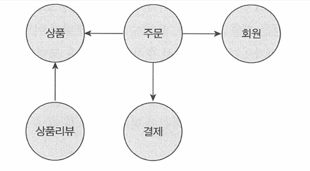
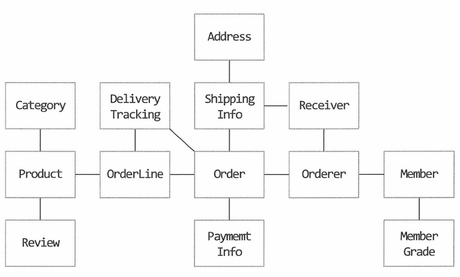
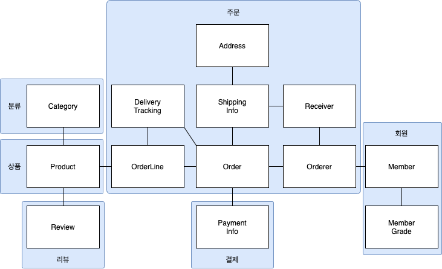
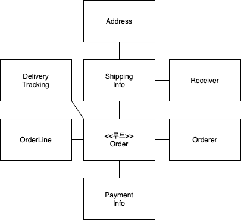

# 3장. 애그리거트  

      
> # 3.1. 애그리거트(Aggregate)
>
> - 상위 수준에서 전체모델을 정리하면, 도메인 모델의 복잡한 관계를 이해하는데 도움이 됨.
>   
>  
> - 개별 객체수준에서 모델을 바라보면 상위 수준의 관계 파악이 어려움.      
>   
>
>  - 객체 모델이 복잡해지면 전반적인 구조나 도메인간의 관계를 파악이 어려워, 코드의 변경 확장이 어려워짐, 코드변경회피로 이어짐.
>  - 복잡한 도메인을 이해하고 관리하기 쉬운 단위로 만드는 방법인, 애그리거트 필요.
>  - 애그리거트하여, 연관된 엔티티와 밸류 객체를 개념적으로 하나로 묶어 하나의 군으로 바라보면, 상위수준에서 모델간의 관계를 파악 가능.
>   
>   


>> ### 애그리거트 장점
>>  - 모델 이해가 쉬움. 
>>  - 일관성관리의 기준:애그리거트 단위로 일관성을 관리.
>>  - 복잡도가 낮아짐: 복잡한 도메인을 단순한 구조로 만듬.
>>  - 도메인 기능 확장과 변경하는데 필요한 노력(개발시간)단축.
>> <br></br>
>>  ### 애그리거트 특징 
>>  - 한 애그리거트에 속한 객체는 유사하거나 동일한 라이프 사이클을 가짐 
>>  -   예) ‘Order', 'OrderLine', ‘Orderer’ 는 "함께 생성", "함께 제거". 
>>  - 애그리거트는 경계를 가짐. 애그리거트는 독립된 객체군이며 각 애그리거트는 자기 자신을 관리할 뿐 다른 애그리거트를 관리하지 않음. 
>>  - 경계 설정은 "도메인규칙"과 "요구사항" 기반. 
>>  - 경계 설정 시, "변경 주체"가 다른경우 서로 다른 애그리거트에 속함.  
>>   -  예) 요구사항: 상품 상세페이지에 들어가면 상품 상세 정보와 함께 리뷰 내용을 보여줘야 한다. 
>>         ‘Product'와'Review'는 함께 생성되지 않고, 함께 변경되지 않고, 변경주체(Product:상품담당자/ Review:고객)도 다름.  

<br/><br/><br/>  
> # 3.2. 애그리거트 루트
> - 애그리거트에 속한 모든 객체가 일관된 상태를 유지하려면 애그리거트 천체를 관리할 주체가 필요.
> - 애그리거트 루트 엔티티는 애그리거트의 대표 엔티티임.
> - 애그리거트에 속한 객체는 애그리거트 루트엔티티에 직접 또는 간접적으로 속함.
> - 예) 주문 에그리거트에서 루트 역할을 하는 엔티티는 'Order'임.  
> 
>      
>
     
>> ## 3.2.1 도메인 규칙과 일관성 
>> - 애그리거트 루트의 핵심 역할은 애그리거트의 일관성을 지키는 것임.
>> - 애그리거트 루트는 애그리거트가 제공해야 할 도메인 기능을 구현. 
>> - 애그리거트 루트가 제공하는 메서드는 도메인 규칙에 따라 애그리거트에 속한 객체의 일관성이 깨지지 않도록 구현.
>> - 애그리거트 루트가 아닌 애그리거트에 속한 객체를 직접 변경하면 안됨.
>> 
>> **<불필요한 중복을 피하고 애그리거트 루트를 통해서만 도메인 로직을 구현하는 법>** 
>>  1. 단순히 필드를 변경하는 set 메서드를 공개(public) 범위로 만들지 않는다.
>>  2. 밸류 타입은 불변으로 구현한다.
>> 
>> - 공개 set 메서드는 중요 도메인의 의미나 의도를 표현하지 못하고 도메인 로직이 도메인 객체가 아닌 응용 영역이나 표현 영역으로 분산되게 만드는 원인이 됨.
>> - 밸류 객체가 불변이면 밸류객체의 값을 변경하는 방법은 새로운 밸류객체를 할당하는 것 뿐임. 
>> - 밸류타입의 내부 상태를 변경하려면 애그리거트 루트를 통해서만 가능.
>> 
>> 
>> 

>> ## 3.2.2.애그리거트 루트의 기능 구현 
>> - 애그리거트 루트는 애그리거트 내부의 다른 객체를 조합해서 기능을 완성한다.
>> - 아래 코드에서 *Order*는 총 주문 금액을 구하기 위해 *OrderLine*목록을 사용한다.  
```java
public class Order {
  private Money totalAmounts;
  private List<OrderLine> orderLines;
 
  private void calculateTotalAmounts() {
    int sum = orderLines.stream()
           .mapToInt(ol -> ol.getPrice() * ol.getQuantity())
           .sum();
    this.totalAmounts = new Money(sum);
  }
}
```
>> - 애그리거트 루트는 암호 변경을 위해 *Password*객체에 암호가 일치하는지를 확인한다.
```java
public class Member {
  private Password password;
 
  public void changePassword(String currentPassword, String newPassword) {
    if (!password.match(currentPassword)) {
      throw new PasswordNotMatchException();
    }
    this.password = new Password(newPassword);
  }
}
```
>> - 기능 실행을 위임하기도 한다
```java
public class OrderLines {
  private List<OrderLine> Lines;
 
   public Money getTotalAmounts() { ...구현;  }
   public void changeOrderLines(List<OrderLines> newLines) {
     this.lines = newLines;
   }
} 

public class Order {
  private OrderLines orderLines;
 
  public void changeOrderLines(List<OrderLine> newLines) {
    orderLines.changeOrderLines(newLines);
    this.totalAmounts = orderLines.getTotalAmounts();
  }
}
``` 
>> 이런경우 *orderLines.changeOrderLines*만 독립적으로 호출하면 *order*의 총합과 불일치 발생
>> *orderLines*를 불변으로 구현하거나, 불가능 상황이면 *protected* 범위로 한정해라.


>> ## 3.2.3.트랜젝션 범위

>> - 트랜잭션 범위는 작을수록 좋음. 
>> - 한 트랜잭션에서는 한 개의 애그리거트만 수정해야 함.
>> - 부득이하게 한 트랜잭션으로 두 개 이상의 애그리거트를 수정해야 한다면 응용 서비스에서 두 애그리거트를 수정하도록 구현.
>> - 도메인 이벤트를 사용하면 한 트랜잭션에서 한 개의 애그리거트를 수정하면서도 동기나 비동기로 다른 애그리거트의 상태를 변경할 수 있음. 
>>    
>> **<두 개 이상의 애그리거트를 변경하는 것을 고려할 수 있는 경우>**
>>  1. 팀 표준 : 조직의 표준에 따라 사용자 유스케이스와 관련된 응용 서비스의 기능을 한 트랜잭션으로 실행해야 하는 경우.
>>  2. 기술 제약 : 한 트랜잭션에서 두 개 이상의 애그리거트를 수정하는 대신 도메인 이벤트와 비동기를 사용하는 방식을 사용하는데, 기술적으로 이벤트 방식을 도입할 수 없는 경우 한 트랜잭션에서 다수의 애그리거트를 수정해서 일관성을 처리해야 함.
 >> 3. UI 구현의 편리 : 운영자의 편리함을 위해 주문 목록 화면에서 여러 주문의 상태를 한 번에 변경하고 싶을 경우.


<br/><br/><br/>  
>   
> # 3.3. 리포지터리와 애그리거트 
> - 애그리거트는 개념적으로 완전한 한개의 도메인 모델 표현.
> - 리포지터리는 애그리거트 전체를 저장소에 영속화.
> - 예) Order 애그리거트를 저장할 때 애그리거트 루트와 매핑되는 테이블뿐만 아니라 애그리거트에 속한 모든 구성요소를 위한 테이블에 데이터를 저장해야 함.
> - 애그리거트를 구하는 리포지터리 메서드는 완전한 애그리거트를 제공해야 함.  

<br/><br/><br/>  
>   
> # 3.4. ID를 이용한 애그리거트 참조 
>  - 애그리거트 간의 참조는 필드를 통해 쉽게 구현 가능. 
>  - JPA를 사용하면 @ManyToOne, @OneToOne과 같은 애노테이션을 이용해서 연관된 객체를 로딩하는 기능을 제공하고 있으므로 필드를 이용해서 다른 애그리거트를 쉽게 참조 가능 
>  - **필드를 이용한 애그리거트 참조는 다음의 문제를 야기.**
>   1. 편한 탐색 오용
>   2. 성능에 대한 고민
>   3. 확장 어려움
> - ID를 이용해서 다른 애그리거트를 참조하는 방식의 장점
>   1. 모든 객체가 참조로 연결되지 않고 한 애그리거트에 속한 객체들만 참조로 연결된다.
>   2. 모델의 복잡도를 낮춰준다.
>   3. 애그리거트 간의 의존을 제거하므로 응집도를 높여주는 효과도 있다.
>   4. 구현 복잡도도 낮아진다. 
>    -> 다른 애그리거트를 직접 참조하지 않으므로 애그리거트 간 참조를 지연로딩 할지 즉시 로딩으로 할지 고민하지 않아도 된다.
>    -> 참조하는 애그리거트가 필요하면 응용 서비스에서 ID를 이용해서 로딩하면 된다.

```java
public class ChangeOrderService{
	@Transactional
	public void changeShippingInfo(OrderID id, ShippingInfo newShippingInfo, 
		boolean useNewShippingAddrAsMemberAddr) {

		Order order = orderRepository.findbyId(id);
		if (order == null) throw new OrderNotFoundException();
		order.changeShippingInfo(newShippingInfo);

		if(useNewShippingAddrAsMemberAddr){
			//아이디를 이용한 참조
			Customer customer = customerRepository.findById(
					order.getOrderer().getCustomerId());
			customer.changeAddress(newShippingInfo.getAddress());
		}
	}
...
}
```

>> ## 3.4.1. ID를 이용한 참조와 조회 성능 
>>  - 다른 애그리거트를 ID참조하면 참조하는 여러애그리거트를 읽을 때 조회속도가 문제될 수 있음.
>>  - ID 참조 방식을 사용하면서 N+1조회와 같은 문제가 발생되지 않도록 하려면 전용쿼리를 사용해야함.  
>>   - 예) 데이터 조회를 위한 별도 DAO를 만들고 DAO의 조회 메서드에서 조인을 이룔해 한 번의 쿼리로 데이터 로딩하면 됨.
>>  - 애그리거트마다 서로다른 저장소를 사용할 경우, 캐시를 적용하거나 조회전용 저장소를 따로 구현해야함. 

```java
Member member = memberRepository.findById(ordererId);
List<Order> orders = orderRepository.findByOrderer(ordererId);
List<OrderView> dtos = orders.stream()
			.map(order -> {
				ProductId prodId = order.getOrderLines().get(0).getProductId();
				//각 주문마다 첫 번째 주문 상품 정보 로딩 위한 쿼리 실행
				Product product = productRepository.findById(prodId);
				return new OrderView(order,customer,product);
		} ).collect(toList());
```


<br/><br/><br/>  
>   
> # 3.5. 애그리거트 간 집합 연관 
> - 애그리거트 간 1:N과 M:N 연관은 컬렉션을 이용하여 표현가능.
> - 개념적으로 존재하는 애그리거트 간의 1:N 연관을 실제 구현에 반영하는것이 요구사항을 충족하는 것과 상관없는 경우가 있음.
>   - 예) 특정 카테고리에 있는 상품 목록을 보여주는 요구사항  
> - 실제 구현에서는 상품에서 카테고리로의 단방향 M-N연관만 적용하면 됨 
> 
> - M:N 연관은 개념적으로 양쪽 애그리거트에 컬렉션으로 연관을 만든다. RDBMS를 이용해서 M:N 연관을 구현하려면 조인 테이블을 사용한다.


<br/><br/><br/>  
>   
> # 3.6. 애그리거트를 팩토리로 사용하기  
> - 애그리거트를 팩토리로 사용하면 도메인 응집도가 높아짐.
> - 애그리거트가 갖고 있는 데이터를 이용해서 다른 애그리거트를 생성해야 할 경우, 애그리거트에 팩토리 메서드 구현 고려.
> - 예) 온라인 쇼핑몰에서 고객이 여러 차례 신고를 해서 특정 상점이 더 이상 물건을 등록하지 못하도록 차단한 상태
>  - 
