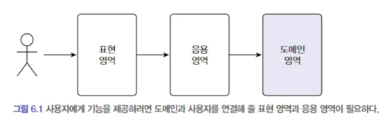
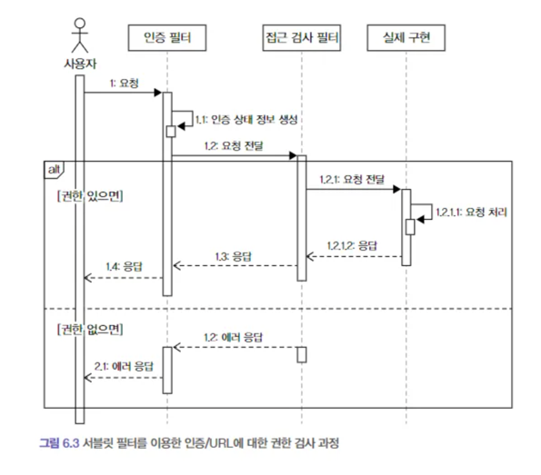
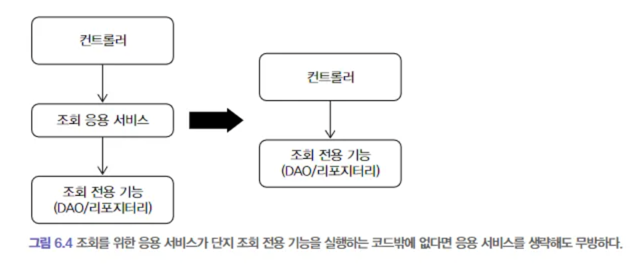

# 도메인 주도 개발 시작하기

## Chapter 6. 응용 서비스와 표현 영역
> 표현 영역과 응용 서비스 영역의 역할과 책임에 대해 이해한다.

### 개요
- 6.1 표현 영역과 응용 영역
- 6.2 응용 서비스의 역할
- 6.3 응용 서비스의 구현
- 6.4 표현 영역
- 6.5 값 검증
- 6.6 권한 검사
- 6.7 조회 전용 기능과 응용 서비스

### 6.1 표현 영역과 응용 영역

- 표현 영역 : 사용자의 요청을 검증 후 응용 서비스 영역에 전달한다.
  - Controller class
  - Servlet, URL, 요청 파라미터, 쿠키, 헤더 등
- 응용 서비스 영역 : 기능을 실행하는 데 필요한 입력 값을 메서드 인자로 받고 실행 결과를 리턴한다.
  - Service class
- 사용자와 상호작용은 표현 영역이 처리하기 때문에, 응용 서비스는 표현 영역에 의존하지 않는다.
  - 응용 서비스는 실행에 필요한 입력을 받고 결과를 리턴하기만 한다.
  
### 6.2 응용 서비스의 역할
- 응용 서비스는 표현 영역과 도메인 영역을 연결해주는 브릿지 역할이다.
  - 표현 영역 <-> 응용 영역 <-> 도메인 영역
  - 레이어 계층구조
- 응용 서비스는 트랜잭션 처리를 담당한다.
  - DB 관련 작업 중 예상치 못한 에러가 발생하면 트랜잭션 단위로 roll-back 
- 응용 서비스가 도메인 로직을 일부 구현하게 되면 코드 중복, 로직 분산 등 코드 품질에 좋지 않은 영향을 줄 수 있다.
  - 코드 응집성이 떨어짐
  - 여러 응용 서비스에서 동일한 도메인 로직을 구현할 가능성이 큼
    - 예시 : 암호 확인 코드를 도메인에서 구현하면 가져다 쓰면 되지만, 응용 서비스에서 구현하면 각 서비스 별로 중복해서 구현해야 함
  - 위 문제들이 많아지면 관리(변경의 용이성)가 쉽지 않게 됨
- 소프트웨어의 가치를 높이려면 핵심 로직은 도메인에 구현하여 중복을 줄이고 응집도를 높여야 한다.

### 6.3 응용 서비스의 구현
- 한 서비스 클래스에 특정 도메인의 모든 기능 구현 vs 구분되는 기능별로 서비스 클래스 추가하여 별도로 구현
  - 통합 시 특징
    - 각 기능에서 동일 로직에 대한 코드 중복 제거할 수 있음(회원 정보 조회 등)
    - 클래스 코드와 크기가 커져 읽기가 힘들고, 점점 불필요한 코드들이 쌓이게 되는 초석이 됨
  - 분리 시 특징
    - 기능별로 클래스 개수는 많아지지만 위 통합 방식에 비해 코드 품질을 일정 수준으로 유지하는데 도움이 됨
    - 기능 클래스 별로 필요한 의존 객체만 포함해서 다른 기능을 구현한 코드에 영향을 받지 않음
    - 회원 정보 조회와 같이 코드 중복이 있을 수 있으나, 별도 클래스로 관리하여 해결 할 수 있다.(예시 - 영속성 관리하는 클래스)
  - 기능 별로 분리하여 사용하는 방식을 권장한다.
- 각 서비스 클래스 마다 인터페이스를 이용하여 구현해야 하는가?
  - Adapter 클래스와 같이 구현 클래스가 다수 존재하거나 런타임에 구현 객체를 교체하는 경우에 인터페이스를 사용한다.
  - 단위 테스트의 경우 Mockito를 이용하여 진행 가능하다.
- 요청 파라미터가 두개 이상이라면 데이터 전달 클래스를 만들어서 사용한다.(Request, Response DTO)
- HttpServletRequest와 같이 표현 영역에서 사용되는 클래스를 응용 서비스 영역의 파라미터로 전달하면 안된다.
  - 서비스 영역에서 표현 영역에 대한 의존이 발생하면 안된다.
  - 테스트가 어려워지고, 표현 영역의 응집도가 깨져 유지 보수하기가 어려워진다.
  - 레이어 별 역할과 책임 분리를 고려하여 설계하도록 한다.
- 스프링에서 제공하는 `@Transactional`을 이용하여 트랜잭션을 관리 할 수 있다.

### 6.4 표현 영역
- 첫 번째 책임 : 사용자가 시스템을 사용할 수 있도록 알맞은 흐름(화면)을 제공하는 것이다.
  - 응용 서비스를 이용하여 표현 영역의 요청을처리하고 그 겨로가를 응답으로 전송한다.
- 두 번째 책임 : 사용자의 요청에 맞게 응용 서비스에 기능 실행을 요청하는 것이다.
  - 응용 서비스에 필요한 파라미터 타입으로 변환하고, 그 결과를 사용자에게 응답 할 수 있는 형식으로 변환한다.
- 세 번째 책임 : 사용자의 연결 상태인 세션을 관리하는 것이다.
  - 웹은 쿠키나 서버 세션을 이용해서 사용자의 연결 상태를 관리한다.

### 6.5 값 검증
- 값 검증은 표현 영역과 응용 서비스 두 곳에서 모두 수행 가능하다.
  - 표현 영역 : 필수 값, 값의 형식, 번위 등 검증
    - 단순 요청 값 검증 - 요청 타입 및 null 여부 등
  - 서비스 영역 : 데이터의 존재 유무와 같은 논리적 오류 검증
    - 도메인 유효성 검증 - 환불 불가 등
- 작가는 응용 서비스에서 모든 검증을 진행하는 편이라고 했는데, 위처럼 분리하는 편이 역할 분리 관점에서 좋아보인다.
  - Controller에서는 단순 값 검증, Service에서는 도메인 오류 검증

### 6.6 권한 검사

- 사용자의 인증 여부 및 각 기능별 권한 검사하는 경우 스프링 시큐리티를 사용할 수 있다.
  - 스프링 시큐리티 : 유연하고 확장 가능한 구조를 갖고 있으나 복잡하다.
- 보통 세 곳에서 권한 검사를 수행한다.
  - 표현 영역 : 인증된 사용자인지 아닌지 검사하고 인증되지 않은 사용자의 경우 로그인 화면으로 리다이렉트 시킴
    - 서블릿 필터를 사용하여 인증 여부 뿐 아니라 URL 별 권한 검사를 할 수 있음
    - 스프링 시큐리티는 이와 유사한 방식으로 필터를 사용하여 인증 정보를 생성하고 웹 접근을 제어함
  - 응용 서비스 : 메서드 단위로 권한 검사를 수행
    - 스프링 시큐리티는 AOP를 활용해서 서비스에 대한 권한 검사를 할 수 있는 기능을 제공
    - 예시 - `@PreAuthorize("hasRole('ADMIN')")`
  - 도메인
    - 스프링 시큐리티를 확장하여 각 도메인 객체 수준의 권한 검사가 가능하지만, 프레임워크에 대한 높은 이해도가 필요함
    - 프레임워크에 대한 이해도가 높지 않다면 도메인에 맞는 권한 검사 기능을 직접 구현하는 것이 코드 유지보수 측면에서 유리함

### 6.7 조회 전용 기능과 응용 서비스

- 서비스에서 수행하는 추가 로직이 없고, 단일 쿼리만 실행하는 조회 전용으로 트랜잭션이 필요하지 않은 경우에는 서비스 없이 표현 영역에서 바로 사용해도 무방하다.
  - 예시 - Controller에서 Repository 조회 호출해서 바로 응답
  - 개인적으로는 코드 일관성 및 DTO 변환 등의 이유로 단순 조회성이라도 Service 클래스를 통해 진행하는 편이 좋다고 생각
- 조회 전용에 대하여는 CQRS에서 다시 살펴보도록 한다.

 

## Reference
- 최범균 - 도메인 주도 개발 시작하기
